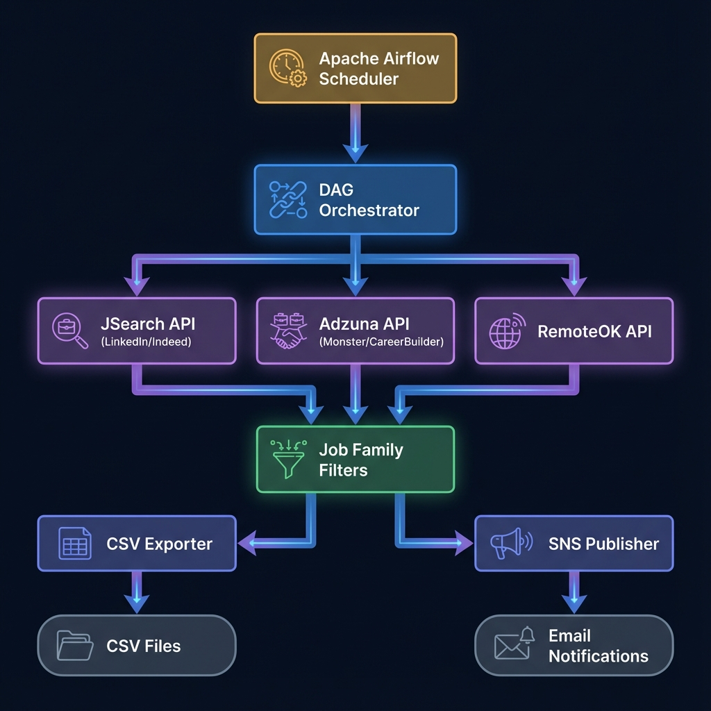
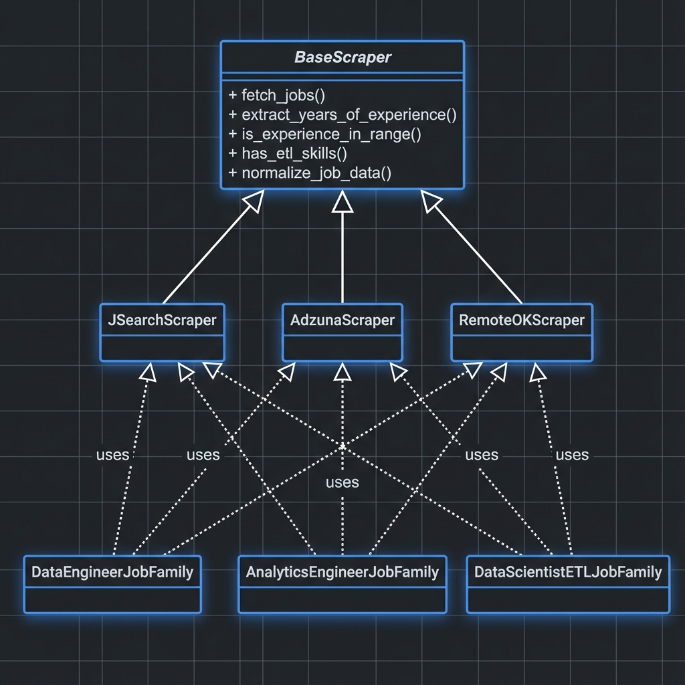
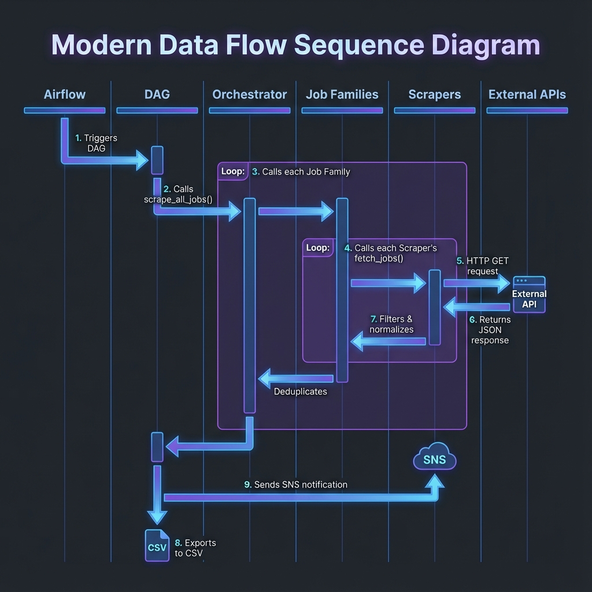

# 🏗️ Multi-Source Job Scraper: Architecture Guide

A visual and detailed explanation of the system architecture, class design, and data flow.

---

## 📋 Table of Contents

1. [System Architecture (High-Level Design)](#1-system-architecture-high-level-design)
2. [Class Hierarchy (Low-Level Design)](#2-class-hierarchy-low-level-design)
3. [Data Flow Sequence](#3-data-flow-sequence)
4. [Component Deep Dive](#4-component-deep-dive)
5. [Design Patterns](#5-design-patterns)
6. [Job Data Schema](#6-job-data-schema)

---

## 1. System Architecture (High-Level Design)



### Layer Breakdown

The system is organized into **6 distinct layers**, each with a specific responsibility:

| Layer | Component | Technology | Responsibility |
|-------|-----------|------------|----------------|
| **Scheduling** | Apache Airflow | Python/Celery | Triggers pipeline every 6 hours (6AM, 12PM, 6PM, 12AM PST) |
| **Orchestration** | DAG | Airflow DAG | Chains tasks using XCom for data passing |
| **Data Collection** | Scrapers | HTTP/REST APIs | Fetches raw job data from 3 external sources |
| **Processing** | Job Families | Python | Filters by role, experience (3-7 years), ETL skills |
| **Storage** | CSV Exporter | Pandas | Persists timestamped job listings to `output/` |
| **Notification** | SNS Publisher | AWS SDK (boto3) | Sends email alerts with job breakdown |

### Data Sources

| Source | API | Platforms Covered | Authentication |
|--------|-----|-------------------|----------------|
| **JSearch** | RapidAPI | LinkedIn, Indeed, Glassdoor, ZipRecruiter | API Key required |
| **Adzuna** | Official API | Monster, CareerBuilder, SimplyHired | App ID + Key required |
| **RemoteOK** | Public API | Remote-focused positions | No authentication |

---

## 2. Class Hierarchy (Low-Level Design)



### Scraper Inheritance

The scraper system uses **inheritance** to provide a consistent interface while allowing platform-specific implementations:

```
BaseScraper (Abstract)
    │
    ├── JSearchScraper      → LinkedIn, Indeed, Glassdoor
    ├── AdzunaScraper       → Monster, CareerBuilder
    └── RemoteOKScraper     → Remote-focused jobs
```

#### BaseScraper Methods

| Method | Type | Description |
|--------|------|-------------|
| `fetch_jobs(job_title, page)` | Abstract | Must be implemented by each scraper |
| `extract_years_of_experience(text)` | Static | Parses "3-5 years experience" from text using regex |
| `is_experience_in_range(desc, min, max)` | Static | Returns `True` if job fits 3-7 years requirement |
| `has_etl_skills(text)` | Static | Returns `True` if description has ≥2 ETL skills |
| `normalize_job_data(job, source)` | Static | Converts raw API response to standard format |

### Job Family Handlers

Each job family **uses all three scrapers** and applies role-specific filtering:

| Job Family | Search Terms | Special Filter |
|------------|--------------|----------------|
| `DataEngineerJobFamily` | "Data Engineer", "Senior Data Engineer", "Lead Data Engineer" | Experience 3-7 years |
| `AnalyticsEngineerJobFamily` | "Analytics Engineer", "BI Engineer", "Senior Analytics Engineer" | Experience 3-7 years |
| `DataScientistETLJobFamily` | "Data Scientist", "ML Engineer", "Data Scientist Python" | Experience 3-7 years **+ must have ≥2 ETL skills** |

---

## 3. Data Flow Sequence



### Step-by-Step Execution

```
┌─────────────────────────────────────────────────────────────────────────────┐
│  STEP 1: Airflow Scheduler triggers DAG (cron: 0 6,12,18,0 * * *)          │
└────────────────────────────────┬────────────────────────────────────────────┘
                                 ▼
┌─────────────────────────────────────────────────────────────────────────────┐
│  STEP 2: Task 1 - scrape_jobs_task()                                        │
│          └── Calls job_scraper.scrape_all_jobs()                            │
│              └── Initializes all 3 Job Family handlers                      │
│                  └── Each family calls all 3 scrapers                       │
│                      └── Each scraper makes HTTP GET to external API        │
│                          └── API returns JSON with job listings             │
│                  └── Family filters by experience & skills                  │
│                  └── Family normalizes data format                          │
│              └── Orchestrator deduplicates across sources                   │
│          └── Pushes jobs list to XCom                                       │
└────────────────────────────────┬────────────────────────────────────────────┘
                                 ▼
┌─────────────────────────────────────────────────────────────────────────────┐
│  STEP 3: Task 2 - export_csv_task()                                         │
│          └── Pulls jobs from XCom                                           │
│          └── Calls csv_exporter.export_to_csv(jobs)                         │
│          └── Creates file: output/job_listings_YYYYMMDD_HHMMSS.csv         │
│          └── Calculates role breakdown                                      │
│          └── Pushes filepath and counts to XCom                             │
└────────────────────────────────┬────────────────────────────────────────────┘
                                 ▼
┌─────────────────────────────────────────────────────────────────────────────┐
│  STEP 4: Task 3 - send_notification_task()                                  │
│          └── Pulls job_count, csv_filepath, role_counts from XCom           │
│          └── Calls sns_notifier.send_notification()                         │
│          └── Publishes to AWS SNS topic                                     │
│          └── Subscribers receive email with job summary                     │
└─────────────────────────────────────────────────────────────────────────────┘
```

### XCom Data Passing

Airflow tasks communicate via **XCom** (cross-communication):

| Task | Pushes to XCom | Pulls from XCom |
|------|----------------|-----------------|
| `scrape_jobs` | `jobs` (list of dicts) | — |
| `export_csv` | `csv_filepath`, `job_count`, `role_counts` | `jobs` |
| `send_notification` | — | `csv_filepath`, `job_count`, `role_counts` |

---

## 4. Component Deep Dive

### File Structure

```
airflow_env-1/
│
├── 📁 config/
│   └── config.py              # All configuration (AWS, APIs, search params)
│
├── 📁 dags/
│   └── linkedin_job_scraper_dag.py    # Airflow DAG definition
│
├── 📁 plugins/
│   ├── 📁 scrapers/
│   │   ├── base_scraper.py    # Abstract base + utilities
│   │   ├── jsearch_scraper.py # JSearch/RapidAPI implementation
│   │   ├── adzuna_scraper.py  # Adzuna API implementation
│   │   └── remoteok_scraper.py# RemoteOK implementation
│   │
│   ├── 📁 job_families/
│   │   ├── data_engineer.py        # Data Engineer handler
│   │   ├── analytics_engineer.py   # Analytics Engineer handler
│   │   └── data_scientist_etl.py   # Data Scientist (ETL) handler
│   │
│   ├── job_scraper.py         # Main orchestrator
│   ├── csv_exporter.py        # CSV file generation
│   └── sns_notifier.py        # AWS SNS notifications
│
├── 📁 output/                  # Generated CSV files
│
└── 📁 docs/
    └── 📁 images/              # Architecture diagrams
```

### Configuration Parameters

All settings are centralized in `config/config.py`:

```python
# Job Search
JOB_TITLES = ["Data Engineer", "Analytics Engineer", "Data Scientist ETL", ...]
JOB_LOCATION = "United States"
EXPERIENCE_MIN_YEARS = 3
EXPERIENCE_MAX_YEARS = 7

# ETL Skills (for Data Scientist filtering)
ETL_SKILLS = ["etl", "data pipeline", "airflow", "spark", "sql", 
              "python", "snowflake", "databricks", "dbt", "kafka", ...]

# Schedule (PST timezone)
SCHEDULE_INTERVAL = "0 6,12,18,0 * * *"  # Every 6 hours
SCHEDULE_TIMEZONE = "America/Los_Angeles"
```

---

## 5. Design Patterns

The codebase implements several software design patterns:

### Template Method Pattern
`BaseScraper` defines the algorithm skeleton, subclasses implement `fetch_jobs()`:

```python
class BaseScraper(ABC):
    @abstractmethod
    def fetch_jobs(self, job_title: str, page: int = 1) -> List[Dict]:
        pass  # Each scraper implements this differently
```

### Strategy Pattern
Job families use scrapers interchangeably—any scraper can be swapped in/out:

```python
class DataEngineerJobFamily:
    def __init__(self):
        self.scrapers = [
            JSearchScraper(),   # Can add/remove scrapers
            AdzunaScraper(),
            RemoteOKScraper()
        ]
```

### Facade Pattern
`job_scraper.py` provides a simple interface hiding the complexity:

```python
# Caller doesn't need to know about families, scrapers, or deduplication
from job_scraper import scrape_all_jobs
jobs = scrape_all_jobs()  # Returns all filtered, deduplicated jobs
```

### Factory Pattern
Each job family creates its own scraper instances:

```python
def __init__(self):
    self.scrapers = [JSearchScraper(), AdzunaScraper(), RemoteOKScraper()]
```

---

## 6. Job Data Schema

Every job record follows this standardized schema:

| Field | Type | Example | Description |
|-------|------|---------|-------------|
| `job_id` | string | `"jsearch_abc123"` | Source-prefixed unique ID |
| `title` | string | `"Senior Data Engineer"` | Job title |
| `company` | string | `"Tech Corp"` | Employer name |
| `location` | string | `"San Francisco, CA"` | City, State |
| `remote` | boolean | `true` | Is remote position |
| `job_type` | string | `"Full-time"` | Employment type |
| `posted_date` | string | `"2024-01-15"` | When job was posted |
| `apply_link` | string | `"https://..."` | URL to apply |
| `salary_min` | float | `150000` | Minimum salary |
| `salary_max` | float | `200000` | Maximum salary |
| `salary_currency` | string | `"USD"` | Currency code |
| `experience_required` | string | `"3-7 years"` | Experience range |
| `source` | string | `"JSearch (LinkedIn/Indeed)"` | API source |
| `job_family` | string | `"Data Engineer"` | Role category |
| `scraped_at` | datetime | `"2024-01-15T06:00:00"` | Scrape timestamp |
| `description_snippet` | string | `"We are looking for..."` | First 500 chars |

---

## 🚀 Quick Start

```bash
# Clone and setup
cd airflow_env-1
python3 -m venv venv && source venv/bin/activate
pip install -r requirements.txt

# Configure environment
cp .env.example .env
# Edit .env with your API keys

# Start Airflow
export AIRFLOW_HOME=$(pwd)
airflow db init
airflow scheduler &
airflow webserver --port 8080
```

---

## 📝 Adding New Components

### Adding a New Scraper

1. Create `plugins/scrapers/new_platform_scraper.py`
2. Extend `BaseScraper` and implement `fetch_jobs()`
3. Add to job family `__init__()` methods

### Adding a New Job Family

1. Create `plugins/job_families/new_role.py`
2. Define `JOB_TITLE`, `SEARCH_TERMS`, `REQUIRED_SKILLS`
3. Import and add to `job_scraper.py` orchestrator

---

*Generated on 2024 | Multi-Source Job Scraper Architecture Documentation*
