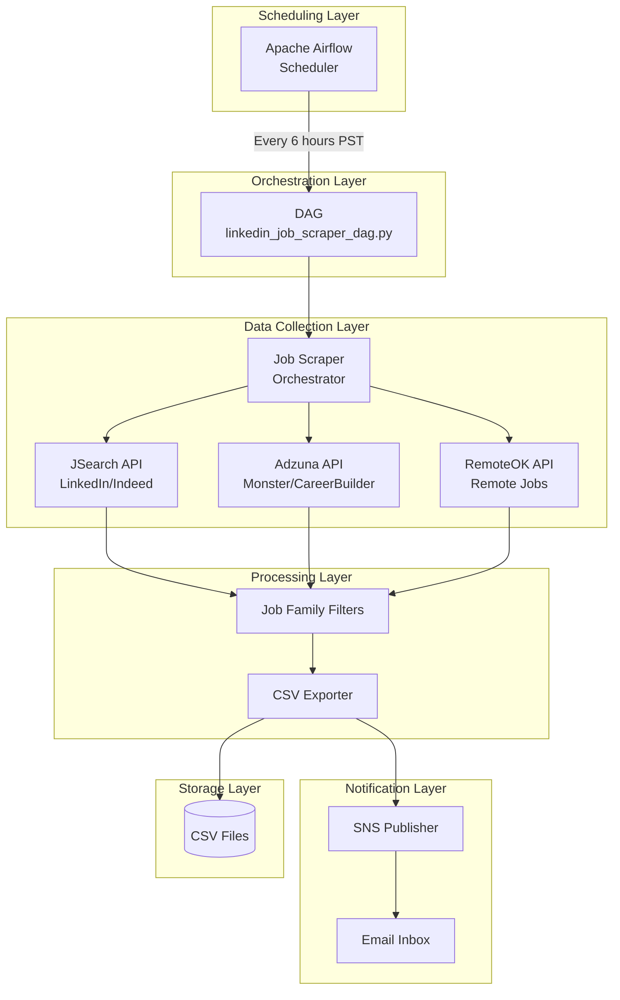
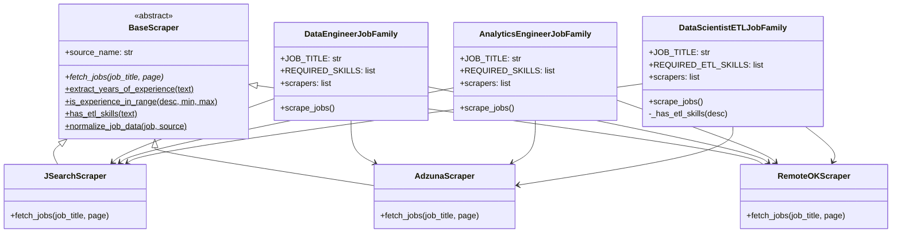
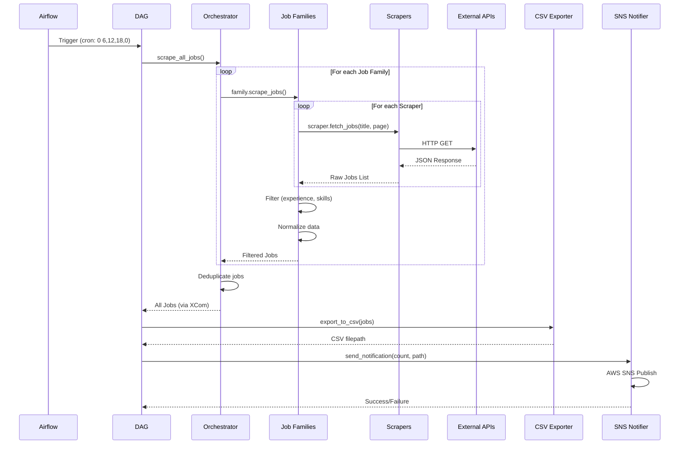
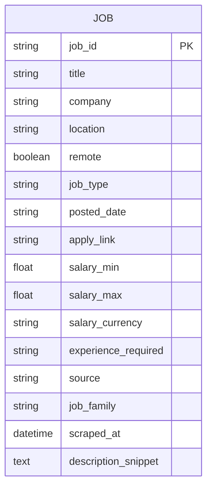
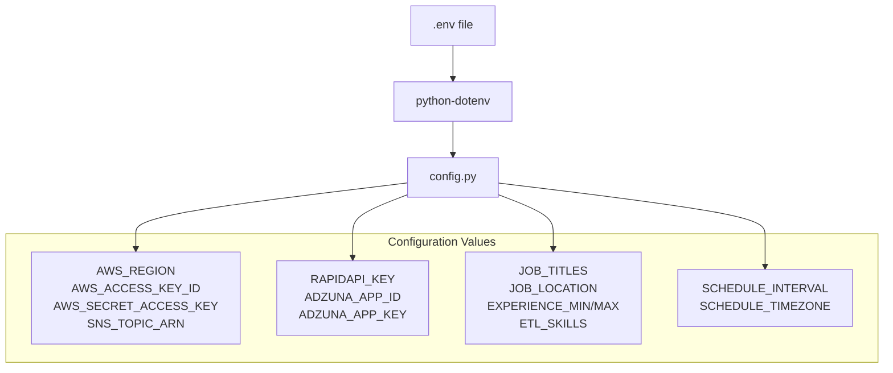

# Multi-Source Job Scraper - System Design

## High-Level Design (HLD)

### System Overview



### Component Responsibilities

| Layer | Component | Responsibility |
|-------|-----------|----------------|
| **Scheduling** | Airflow | Triggers DAG at 6AM/12PM/6PM/12AM PST |
| **Orchestration** | DAG | Chains tasks: scrape → export → notify |
| **Collection** | Scrapers | Fetch raw job data from APIs |
| **Processing** | Job Families | Filter by role, experience, skills |
| **Storage** | CSV Exporter | Persist timestamped job listings |
| **Notification** | SNS Publisher | Send email alerts |

---

## Low-Level Design (LLD)

### Class Diagram



### Data Flow Sequence



### File Dependencies

```mermaid
graph LR
    subgraph "Config"
        CFG[config.py]
    end
    
    subgraph "Scrapers Package"
        BASE[base_scraper.py]
        JS[jsearch_scraper.py]
        AZ[adzuna_scraper.py]
        RO[remoteok_scraper.py]
    end
    
    subgraph "Job Families Package"
        DE[data_engineer.py]
        AE[analytics_engineer.py]
        DS[data_scientist_etl.py]
    end
    
    subgraph "Plugins"
        ORC[job_scraper.py]
        CSV[csv_exporter.py]
        SNS[sns_notifier.py]
    end
    
    subgraph "DAG"
        DAG[linkedin_job_scraper_dag.py]
    end
    
    CFG --> BASE & JS & AZ & RO
    CFG --> DE & AE & DS
    CFG --> CSV & SNS & DAG
    
    BASE --> JS & AZ & RO
    JS & AZ & RO --> DE & AE & DS
    DE & AE & DS --> ORC
    ORC --> DAG
    CSV --> DAG
    SNS --> DAG
```

### Job Data Schema



### Configuration Flow



---

## Key Design Patterns

| Pattern | Usage |
|---------|-------|
| **Template Method** | `BaseScraper` defines algorithm, subclasses implement `fetch_jobs()` |
| **Strategy** | Job families use different scrapers interchangeably |
| **Factory** | Each job family instantiates its own scrapers |
| **Facade** | `job_scraper.py` orchestrator hides complexity |

---

## Scalability Considerations

| Aspect | Current | Scalable To |
|--------|---------|-------------|
| **Scrapers** | 3 platforms | Add new scraper files |
| **Job Families** | 3 roles | Add new family files |
| **Scheduling** | 6-hour intervals | Any cron expression |
| **Storage** | Local CSV | S3, BigQuery, database |
| **Notifications** | Email (SNS) | Slack, SMS, webhooks |
